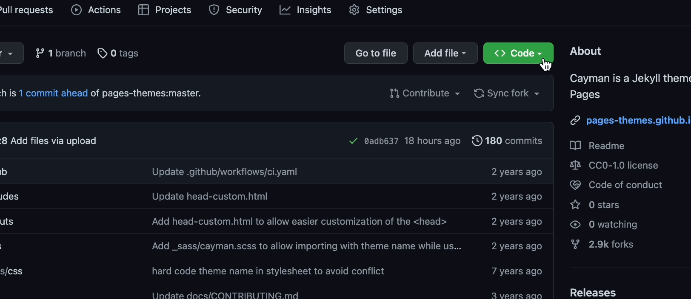
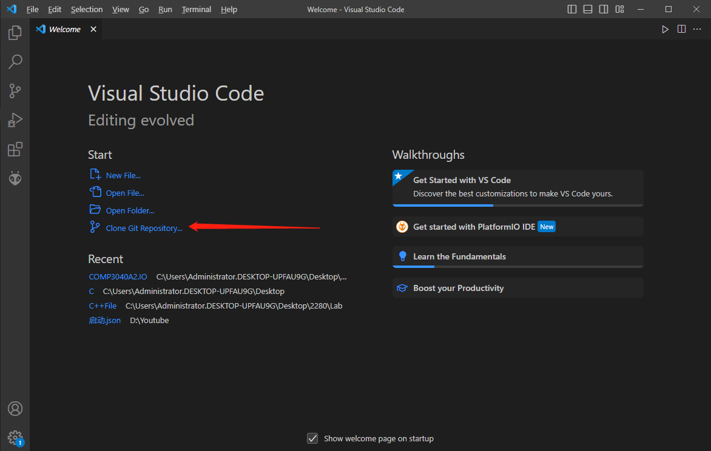
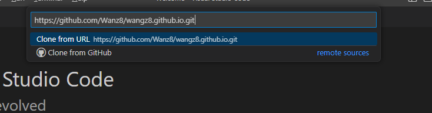
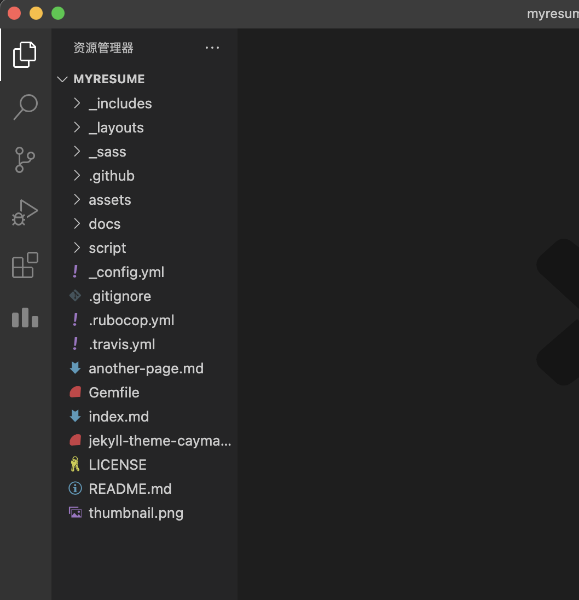
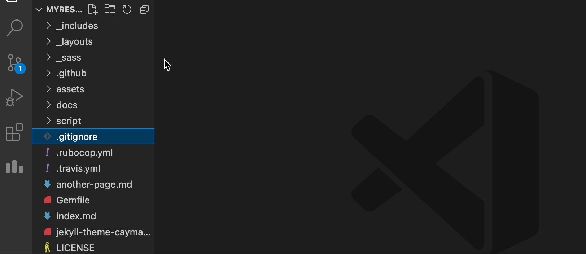
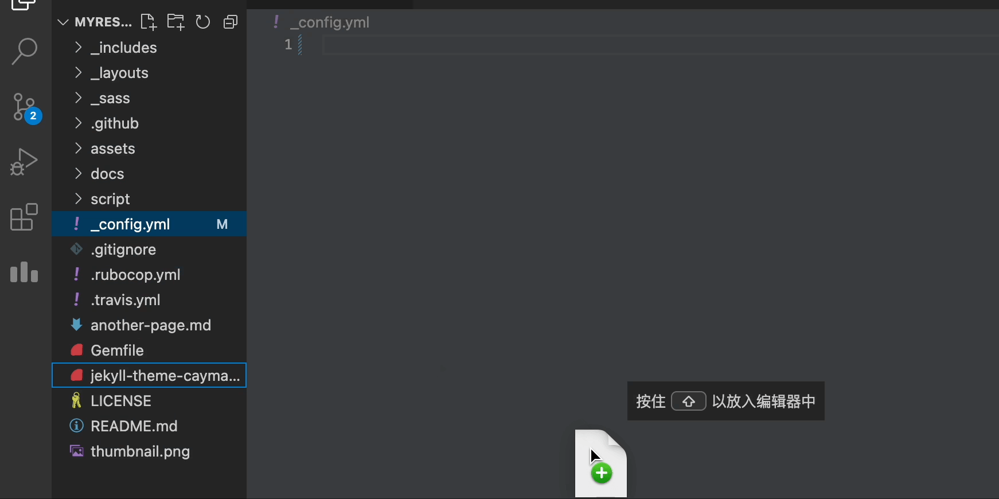

# Hosting and Formatting a Resume on GitHub Pages using Markdown, VS Code, and Jekyll

The purpose of this README is to guide you through the process of hosting and formatting a resume using Markdown, VS Code, GitHub Pages, and Jekyll. We will also relate each practical step to the general principles of current Technical Writing as explained in Andrew Etter's book "Modern Technical Writing."

### Prerequisites
* A Markdown formatted resume
* A GitHub account (If you didn't have yet, click [here](https://github.com/join))
* [Ruby](https://www.ruby-lang.org/en/downloads/)
* [Jekyll](https://jekyllrb.com/docs/installation/)
* Install [markdown editor](https://www.shopify.com/partners/blog/10-of-the-best-markdown-editors)


---
## Instructions


### Create a Repository 
>By the end of this section, you will have:

> * Created a new repository on your GitHub.

#### Step 1: Creating a New repository

1. Log into your [GitHub](https://GitHub.com) account.

2. At the top right corner of the website, click on the '**+**' symbol
3. Select "**New Repository**".

    

3. Give your repository a name. 

    

4. Choose visibility for your repository. You might set "**Public**" Because you want your employer to be able to see your resume
5. Initialise the repository with a README file.

    

6. Click on "**Create Repository**" to create.

7. In the newly created repository navigate to **Settings**

8. In the sidebar click **Pages**
9. Set the deployment source to *Deploy from a branch* under the **Source** section and set the desired publishing branch under the **Branch** section
    - To keep it simple it is recommended that the main branch and root directory is the publishing branch

10. Click Save
---

### Choosing a Jekyll Theme for Your GitHub Page

If you're using GitHub to host your personal website or blog, you might be using Jekyll as your static site generator. Jekyll allows you to easily create and manage a website using plain text files, and there are plenty of pre-made themes available that you can use to customize the look and feel of your site. 

In this guide, we'll go through the steps for choosing a Jekyll theme for your GitHub page.

## Step 1: Determine Your Needs

Before selecting a theme, consider the purpose and content of your GitHub page. Do you need a theme that is focused on blogging or a theme that showcases your portfolio? In this demonstration, I will choose a more concise theme for the resume.

## Step 2: Browse the Supported Jekyll themes

The "GitHub Pages" is a great place to start looking for themes. There are plenty of free themes available that cover a variety of use cases. You can browse the page at [pages.github.com](https://pages.github.com/themes/).

## Step 3: Review the Theme's Documentation

Once you've found your favourite theme, review the documentation to see if it meets your needs. You can find instructions for installation, configuration, and customization. 


---
# Hosting Your Resume on GitHub Pages with the Cayman Theme

This guide will show you how to host your resume on GitHub Pages using the Cayman theme, which is a Jekyll theme created by Jason Long. 
>By the end of this section, you will have:

> * Host your resume on Github Pages with your favourite theme.(This time I will choose Cayman as an example)

## Prerequisites

To follow this guide, you'll need the following:
- Visual Studio Code
- A Resume in Markdown format.
- A repository build by yourselfs.
- The "Cayman theme" repository which you selected.

## Step 1: Copy the URL from your Reponsitory

You need to open your Repository and find the "Code" button. Then copy your URL.


## Step 2: Open the Visual Studio Code

Open Visual Studio Code and select "Clone Git Repository..." on the initial screen.

## Step 3: Clone Your Repositories
1. Paste in the URL you just copied from your repository and Press " Enter".

2. Select a path to store your files. Then you will see your repository with all your files presented on the left side.

## Step 4: Add file to your repository

1. Click on "New Document" and name your file "_config.yml" 
2. Copy the code in "_config.yml" from the Cayman theme repository 
```
 remote_theme: jasonlong/cayman-theme
```
Then paste it into the "--config.yml" file you just created.

3. Drag your Resume into your folder.

## Step 5: 
Save, commit and push into your github repository.

---


---
## More Resources
* [Easy Markdown Tutorial](https://www.markdowntutorial.com)
* [GitHub Flavoured Markdown Reference Sheet](https://guides.github.com/pdfs/markdown-cheatsheet-online.pdf)
* ["Modern Technical Writing" by Andrew Etter](https://www.amazon.com/Modern-Technical-Writing-Introduction-Documentation-ebook/dp/B01A2QL9SS)

---
## Authors and Acknowledgements 
#### **Author**
* [ZHIHAO WANG](https://github.com/Wangz8)  
#### **Group Members/Peer Editors**

#### **GitHub Page Theme**
*  
---
## FAQs
